<table>
<tr>
<td valign="top"></td>
<td valign="top"></td>
</tr>
</table>

## **iMen · Software Engineer**
<!-- Typing Motion -->

<!-- 

 -->

##### Language & Tool's

<table>
  <tr>
    <td align="center" valign="middle" width="50%">
      
    </td>
    <td align="center" valign="middle" width="50%">
      
    </td>
  </tr>
</table>

  
  
  
  
  
  

<!-- 
##### Contribution Graph
 

  

-->

---
   

<!-- Proudly created with GPRM ( https://gprm.itsvg.in ) -->

<!--
**ITTODORI/ITTODORI** is a ✨ _special_ ✨ repository because its `README.md` (this file) appears on your GitHub profile.

Here are some ideas to get you started:

- 🔭 I’m currently working on ...
- 🌱 I’m currently learning ...
- 👯 I’m looking to collaborate on ...
- 🤔 I’m looking for help with ...
- 💬 Ask me about ...
- 📫 How to reach me: ...
- 😄 Pronouns: ...
- ⚡ Fun fact: ...
-->
